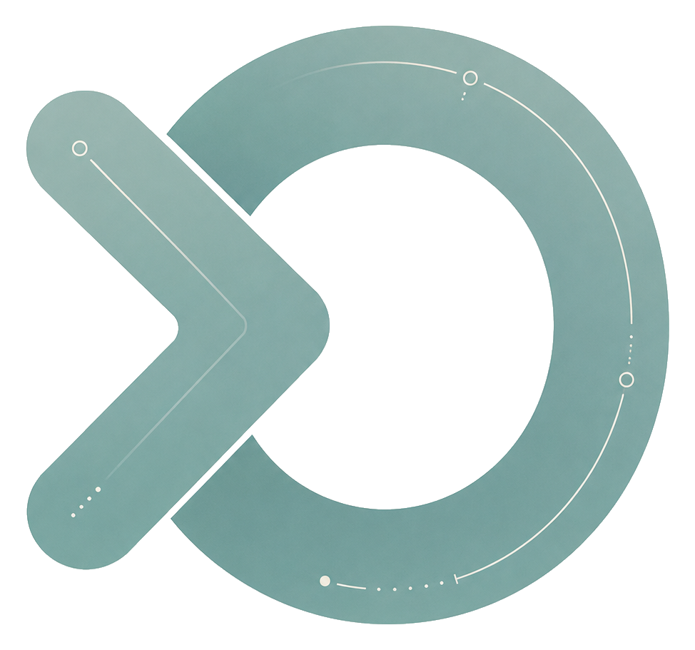

<div align="center">
  

  <h1>Agent Aleph</h1>

  <p>
    A premium AI terminal workspace for developers and coding agents.<br/>
    Retro-futurist interface, persistent sessions, multi-pane layouts, and terminal themes built for long-running agent work.
  </p>

  <p>
    <a href="https://github.com/matiasA/OpenMultiTerm/releases/latest">
      
    </a>
    
    
    
  </p>
</div>

---

## Agent Aleph Design

Agent Aleph turns the original multi-terminal manager into an AI-first command center:

- **Editorial retro-futurist UI** — technical grids, orbital details, fine borders, and a restrained teal/amber/purple palette.
- **Custom icon system** — native SVG icons designed for agents, shells, sessions, layouts, view modes, and utilities.
- **Agent Aleph logo** — transparent brand mark integrated into the title bar.
- **Dark and light terminal art** — curated background sets for both modes, with overlays tuned for prompt readability.
- **Premium terminal panel** — transparent xterm rendering, cinematic backgrounds, and compact controls.

---

## Features

- **Multi-pane grid** — Arrange terminals in 1x1 up to 3x3 grids. The layout adjusts automatically as you open new sessions.
- **AI agent profiles** — Launch tools such as Claude Code, OpenCode, Copilot CLI, Gemini CLI, Codex CLI, Antigravity, Warp, and more.
- **Platform-aware shells** — Windows-only profiles such as PowerShell, Command Prompt, WSL, and Git Bash are hidden on Linux to avoid invalid launches.
- **Persistent terminal sessions** — Closing the window does not kill your shells. A background daemon keeps every PTY alive.
- **Agent-safe restoration** — Reopen the app and return to running processes, scrollback, current layout, and session state.
- **Broadcast mode** — Type once, send to all running terminals.
- **Saved layouts** — Store a terminal arrangement by name and restore it later.
- **Command palette** — Search command history across sessions and re-execute commands quickly with `Ctrl+Shift+P`.
- **Terminal themes** — Includes the Agent Aleph Terminal theme plus familiar themes such as One Dark, Dracula, Tokyo Night, and Nord.
- **Dark and light app themes** — Full UI theme switching with matching terminal artwork.
- **In-terminal search** — Find text inside any terminal panel.
- **Export and copy** — Export full terminal buffers to `.log` files or copy them to the clipboard.
- **Drag and drop** — Reorder terminal panels within the grid.
- **Session rename** — Double-click a terminal title to rename it.
- **Working directory in header** — Each terminal tab shows an abbreviated current working directory.

---

## Download

Get the latest beta from the [Releases](https://github.com/matiasA/OpenMultiTerm/releases/latest) page.

| Platform | File |
|---|---|
| Windows | `OpenMultiTerm-Setup-x.x.x.exe` |
| macOS | `OpenMultiTerm-x.x.x.dmg` |
| Linux | `OpenMultiTerm-x.x.x.AppImage` |

---

## Build from Source

**Requirements:** Node.js 18+, npm

```bash
git clone https://github.com/matiasA/OpenMultiTerm.git
cd OpenMultiTerm
npm install
```

```bash
# Development
npm run dev

# Production build
npm run build

# Package installer
npm run package:win    # Windows (.exe)
npm run package:mac    # macOS (.dmg)
npm run package:linux  # Linux (.AppImage)
```

> Note for Windows: `node-pty` requires native compilation. If you run into build errors, install the Visual C++ Build Tools first.

---

## Keyboard Shortcuts

| Shortcut | Action |
|---|---|
| `Ctrl+Shift+P` | Open command palette |
| `Ctrl+Shift+N` | New terminal from the default profile |
| `Ctrl+Shift+W` | Close active terminal |
| `Ctrl+Shift+B` | Toggle broadcast mode |
| `Ctrl+Shift+S` | Toggle sidebar |
| `Ctrl+Shift+1-9` | Switch to terminal by position |

---

## Shell Profiles

Profiles are stored in the system user data directory and persist between sessions. Each profile defines:

| Field | Description |
|---|---|
| `command` | Executable to launch, such as `bash`, `pwsh`, or `wsl.exe` |
| `args` | Arguments passed to the executable |
| `cwd` | Starting working directory, or `null` for the user home |
| `env` | Extra environment variables merged into the shell environment |

Agent profiles can use `detectCommand` and `launchCommand` so Agent Aleph can detect installed CLIs and launch them inside a stable platform shell.

---

## Tech Stack

| Layer | Technology |
|---|---|
| Shell / PTY | [node-pty](https://github.com/microsoft/node-pty) |
| Terminal renderer | [xterm.js](https://xtermjs.org/) |
| Desktop framework | [Electron](https://www.electronjs.org/) |
| UI | [React](https://react.dev/) + [Tailwind CSS](https://tailwindcss.com/) |
| State | [Zustand](https://github.com/pmndrs/zustand) |
| IPC | WebSocket ([ws](https://github.com/websockets/ws)) over `127.0.0.1` |
| Build | [Vite](https://vitejs.dev/) + [electron-builder](https://www.electron.build/) |
| Language | TypeScript |

---

## License

[MIT](LICENSE) - © 2026 Matias A
