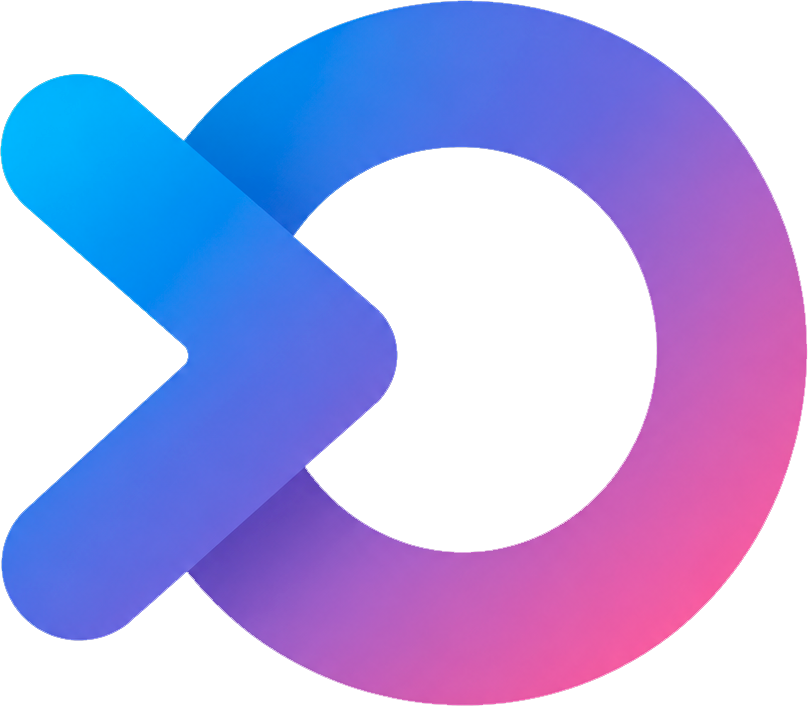
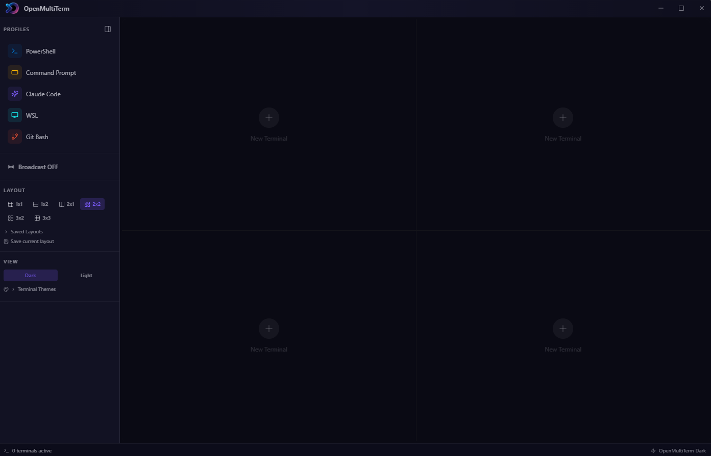

<div align="center">
  

  <h1>OpenMultiTerm</h1>

  <p>
    A modern, open-source multi-terminal manager built for developers.<br/>
    Run multiple shells side by side — grid layout, broadcast mode, and beautiful themes.
  </p>

  <p>
    <a href="https://github.com/matiasA/OpenMultiTerm/releases/latest">
      
    </a>
    
    
    
  </p>

  <br/>

  <!-- Replace with your actual screenshot -->
  
</div>

---

## Features

- **Multi-pane grid** — Arrange terminals in 1×1 up to 3×3 grids. The layout adjusts automatically as you open new sessions.
- **Shell profiles** — Pre-configured profiles for PowerShell, Command Prompt, WSL, Git Bash, and Claude Code. Add your own with custom commands, arguments, working directory, and environment variables.
- **Broadcast mode** — Type once, send to all. Instantly propagate commands across every running terminal simultaneously.
- **Command palette** — Search your command history across all sessions and re-execute any command in one keystroke (`Ctrl+Shift+P`).
- **Saved layouts** — Save your current terminal arrangement by name and restore it with one click.
- **Session snapshots** — OpenMultiTerm remembers your open sessions. Relaunch the app and pick up exactly where you left off.
- **Terminal themes** — Six built-in color themes: OpenMultiTerm Dark, OpenMultiTerm Light, One Dark, Dracula, Tokyo Night, and Nord.
- **Dark & Light app theme** — Full UI theming, not just the terminal.
- **In-terminal search** — Find text inside any terminal panel.
- **Export & copy** — Export the full terminal buffer to a `.log` file or copy it to the clipboard.
- **Drag & drop** — Reorder terminal panels within the grid by dragging.
- **Session rename** — Double-click any terminal title to rename it.

---

## Download

Get the latest installer for your platform from the [Releases](https://github.com/matiasA/OpenMultiTerm/releases/latest) page.

| Platform | File |
|---|---|
| Windows | `OpenMultiTerm-Setup-x.x.x.exe` |
| macOS | `OpenMultiTerm-x.x.x.dmg` |
| Linux | `OpenMultiTerm-x.x.x.AppImage` |

---

## Build from Source

**Requirements:** Node.js 18+, npm

```bash
git clone https://github.com/matiasA/OpenMultiTerm.git
cd openmultiterm
npm install
```

```bash
# Development (hot-reload)
npm run dev

# Production build
npm run build

# Package installer
npm run package:win    # Windows (.exe)
npm run package:mac    # macOS (.dmg)
npm run package:linux  # Linux (.AppImage)
```

> **Note for Windows:** `node-pty` requires native compilation. If you run into build errors, install the [Visual C++ Build Tools](https://visualstudio.microsoft.com/visual-cpp-build-tools/) first.

---

## Keyboard Shortcuts

| Shortcut | Action |
|---|---|
| `Ctrl+Shift+P` | Open command palette |
| `Ctrl+Shift+N` | New terminal (default profile) |
| `Ctrl+Shift+W` | Close active terminal |
| `Ctrl+Shift+B` | Toggle broadcast mode |
| `Ctrl+Shift+S` | Toggle sidebar |
| `Ctrl+Shift+1–9` | Switch to terminal by position |

---

## Shell Profiles

Profiles are stored in your system's user data directory and persist between sessions. Each profile defines:

| Field | Description |
|---|---|
| `command` | Executable to launch (e.g. `powershell.exe`, `wsl.exe`) |
| `args` | Arguments passed to the executable |
| `cwd` | Starting working directory (`null` = user home) |
| `env` | Extra environment variables merged into the shell environment |

Default profiles ship with PowerShell, Command Prompt, Claude Code, WSL, and Git Bash.

---

## Tech Stack

| Layer | Technology |
|---|---|
| Shell / PTY | [node-pty](https://github.com/microsoft/node-pty) |
| Terminal renderer | [xterm.js](https://xtermjs.org/) |
| Desktop framework | [Electron](https://www.electronjs.org/) |
| UI | [React](https://react.dev/) + [Tailwind CSS](https://tailwindcss.com/) |
| State | [Zustand](https://github.com/pmndrs/zustand) |
| Build | [Vite](https://vitejs.dev/) + [electron-builder](https://www.electron.build/) |
| Language | TypeScript |

---

## Contributing

Contributions are welcome. Please open an issue before submitting a large pull request so we can discuss the approach.

```bash
# Fork the repo, then:
git checkout -b feature/your-feature
# ... make your changes ...
git commit -m "feat: describe your change"
git push origin feature/your-feature
# Open a Pull Request
```

---

## License

[MIT](LICENSE) — © 2026 Matias A
